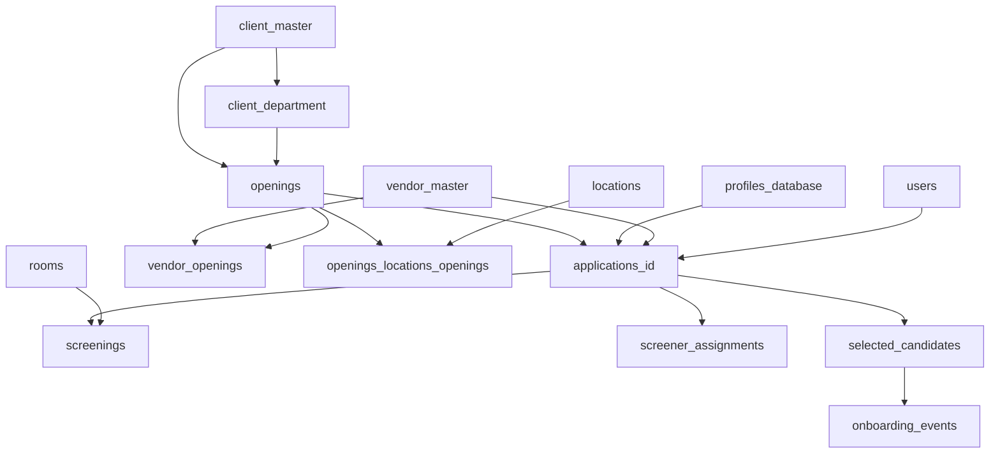

# XPO ATS Supabase Schema and API Migration Notes

## Scope

This document is based on the repository artifacts below, not on a direct connection to your live Supabase instance:

- `airtable-to-supabase/final_migration.sql`
- `airtable-sync-service/sync.js`
- `airtable-sync-service/verify_table_counts.sql`

That means the model here is reliable for the migration code in this repo, but you should still compare it with a fresh Supabase schema dump before switching production traffic.

## Executive Summary

Your schema is moving from an Airtable-style model with copied fields, reverse links, and flattened milestones into a more relational model.

The main direction is correct:

- `applications_id` becomes the center of the hiring pipeline.
- `profiles_database` becomes the canonical candidate table.
- `openings` becomes the canonical job/requisition table.
- repeated screener assignments move into `screener_assignments`
- repeated onboarding milestones move into `onboarding_events`
- vendor-opening relationships move into `vendor_openings`
- status lists move into `status_config`

Decision update for the current target schema:

- `profiles_database.vendors_id` is the canonical vendor link
- `profiles_database.vendor_id` is being removed
- `prompts`, `interview_feedback`, and `interview_rounds` are being removed from PG for now

For the new XPO ATS API, you should build around the normalized tables, not around the old flat Airtable columns.

## Canonical Domain Model

### Master data

| Domain | Table | Notes |
| --- | --- | --- |
| Clients | `client_master` | top-level client record |
| Client departments | `client_department` | belongs to `client_master` via `client_name_id` |
| Locations | `locations` | lookup table |
| Vendors | `vendor_master` | external partner/vendor master data |
| Screeners | `screeners_profile` | screener directory |
| Users | `users` | application users; should move to Supabase Auth |
| Status dictionary | `status_config` | central enum/config table |
| Rooms | `rooms` | interview room/calendar metadata |

### Transactional data

| Domain | Table | Notes |
| --- | --- | --- |
| Openings | `openings` | job/requisition record |
| Candidates | `profiles_database` | canonical candidate profile |
| Applications | `applications_id` | candidate applied/submitted to opening |
| Screenings | `screenings` | screening events |
| Selected hires | `selected_candidates` | post-selection state |

### Normalized and junction tables

| Table | Purpose |
| --- | --- |
| `screener_assignments` | replaces direct screener columns on `applications_id` |
| `onboarding_events` | replaces milestone columns on `selected_candidates` |
| `vendor_openings` | vendor-to-opening mapping with `is_exclusive` |
| `openings_locations_openings` | opening-to-location mapping |
| `candidate_skills` | appears to exist already in the live schema and should be preserved |

## Core Relationships

## What Changed From The Airtable Shape

### Removed anti-patterns

- reverse foreign keys were dropped
- circular links were removed
- duplicated FK columns were removed
- text copies of linked fields were removed
- flat interview stage columns were replaced with rows
- flat onboarding milestone columns were replaced with rows

### New canonical read paths

| API need | Old Airtable-style source | New canonical source |
| --- | --- | --- |
| assigned screeners | columns on `applications_id` | `screener_assignments` + `screeners_profile` |
| onboarding progress | columns on `selected_candidates` | `onboarding_events` |
| opening vendors | linked field / old exclusive table | `vendor_openings` |
| opening locations | copied link field | `openings_locations_openings` |
| dropdown values | hardcoded UI enums | `status_config` |

## Recommended API Resources

Use business resource names in the API even if the underlying table names are legacy.

| API resource | Backing table(s) | Notes |
| --- | --- | --- |
| `/clients` | `client_master` | include departments as nested child resource |
| `/departments` | `client_department` | filter by `client_name_id` |
| `/locations` | `locations` | lookup resource |
| `/vendors` | `vendor_master` | do not expose raw password field |
| `/screeners` | `screeners_profile` | separate from auth users |
| `/users` | `users` or `auth.users` | prefer migrating auth out of this table |
| `/openings` | `openings` | join `client_master`, `client_department`, `vendor_openings`, locations |
| `/candidates` | `profiles_database` | keep this as the canonical candidate profile endpoint |
| `/applications` | `applications_id` | central pipeline resource |
| `/screenings` | `screenings` | event resource |
| `/selected-candidates` | `selected_candidates` | post-selection workflow |
| `/status-config` | `status_config` | parameterize by `domain` |

### Nested resources you should support

- `/applications/:id/screener-assignments` -> `screener_assignments`
- `/openings/:id/vendors` -> `vendor_openings`
- `/openings/:id/locations` -> `openings_locations_openings`
- `/selected-candidates/:id/onboarding-events` -> `onboarding_events`

## Recommended Aggregate Shapes

### Opening details

Build `GET /openings/:id` from:

- `openings`
- `client_master`
- `client_department`
- `vendor_openings` + `vendor_master`
- `openings_locations_openings` + `locations`

### Application details

Build `GET /applications/:id` from:

- `applications_id`
- `profiles_database`
- `openings`
- `vendor_master`
- `users` via `pid_taken_by_id`
- `screener_assignments` + `screeners_profile`
- `screenings`
- `selected_candidates`

### Candidate details

Build `GET /candidates/:id` from:

- `profiles_database`
- linked vendor
- linked location
- applications by candidate
- screenings by candidate

## Important Naming Guidance

Keep these naming rules in the API layer:

- expose `applications` in the API, not `applications_id`
- expose `candidates` in the API, not `profiles_database`
- expose `selectedCandidates` or `selected-candidates`, not table names directly
- use UUID primary keys externally
- treat `airtable_id` as a migration-only bridge key

## Known Migration Gaps Found In This Repo

These are the main schema/data issues I found while reading the SQL and sync code.

### 1. `profiles_database` has conflicting vendor linkage

The earlier migration SQL introduced a canonical `vendor_id` UUID FK, but the current project decision is to keep Airtable-aligned vendor links in `vendors_id`.

Impact:

- candidate vendor ownership may be split across two columns
- your API team could join the wrong field

Recommendation:

- standardize on `profiles_database.vendors_id`
- remove `vendor_id`

### 2. Some new canonical FKs are added in SQL but not populated by the sync service

Added in SQL:

- `client_master.location_id`
- `screeners_profile.vendor_id`
- `users.screener_profile_id`
- `screenings.room_id`

But the sync script does not currently map those fields from Airtable.

Impact:

- your API can expose nullable fields that look supported but are not actually backfilled
- joins may silently return empty nested objects

Recommendation:

- do not make these required in the API until you confirm data population
- add explicit backfill scripts before production cutover

### 3. Plain-text passwords still exist in legacy tables

The repo still maps passwords into:

- `vendor_master.password`
- `users.password`

Impact:

- major security risk
- wrong source of truth for authentication

Recommendation:

- move auth to Supabase Auth
- hash any retained credentials
- remove plain-text password exposure from every API response

### 4. Some derived data is intentionally no longer stored

Airtable formulas, rollups, and lookup copies were removed.

Impact:

- if your old API returned those fields directly, they will now need:
  - SQL views
  - server-side computed fields
  - frontend-derived values

Recommendation:

- define computed API fields explicitly instead of recreating Airtable denormalization everywhere

## Status Strategy

`status_config` should become the source of truth for workflow dropdowns and state labels.

Current seeded domains include:

- `application`
- `opening`
- `screening`
- `selected`
- `screener`
- `vendor`

Recommendation:

- stop hardcoding status labels in the frontend
- fetch status values by domain
- store codes in the app where possible and render labels from config

## Suggested API Migration Sequence

1. Freeze the API contract at the resource level, not the table level.
2. Build read endpoints on top of normalized joins first.
3. Replace flat interview and onboarding payloads with nested arrays.
4. Move enum/status sources to `status_config`.
5. Migrate auth away from legacy `users.password`.
6. Backfill incomplete FKs before enabling write paths.
7. Only then remove compatibility code for old Airtable-shaped responses.

## Verification Before Cutover

Before switching the XPO ATS API to Supabase, verify:

- row counts for core and normalized tables
- no orphaned FK references
- `screener_assignments` counts match old screener columns
- `onboarding_events` counts match old selected-candidate milestone columns
- every API-critical FK is populated where expected

You already have a basic count check in `airtable-sync-service/verify_table_counts.sql`.

## Bottom Line

The target model is suitable for an ATS API, but only if the API is designed around the normalized tables and not around the old Airtable field layout.

The biggest things to fix before migration are:

- canonicalize candidate vendor linkage
- backfill the new but currently unpopulated FK columns
- remove plain-text-password usage
- make `status_config` the shared enum source
